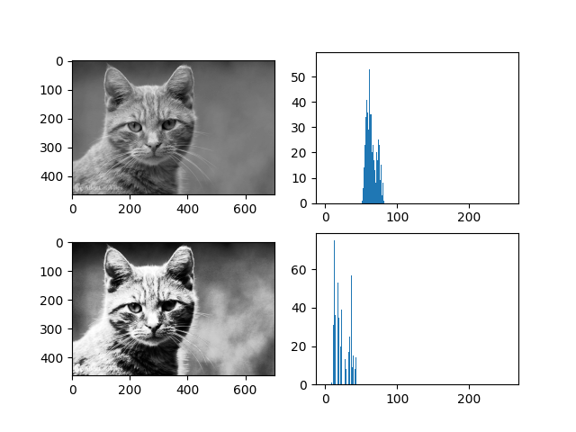
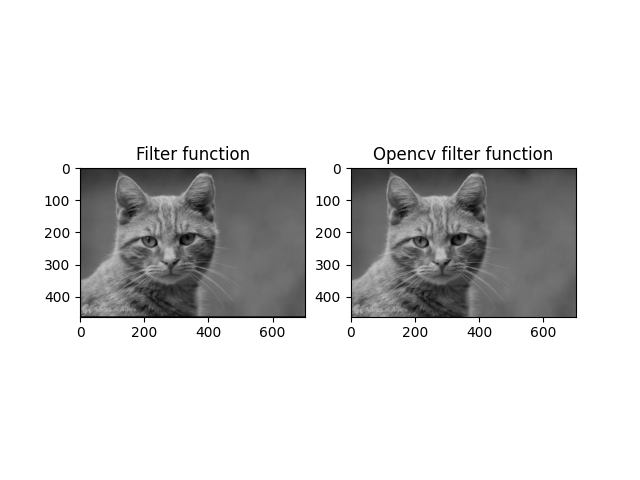
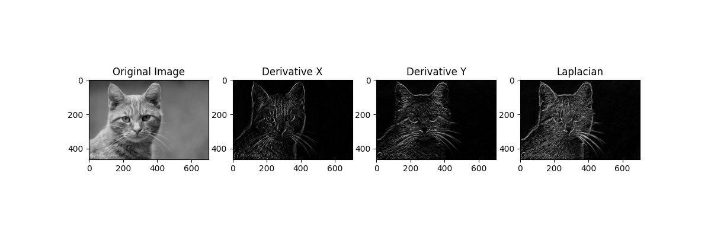
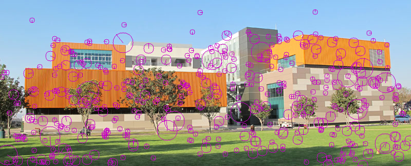
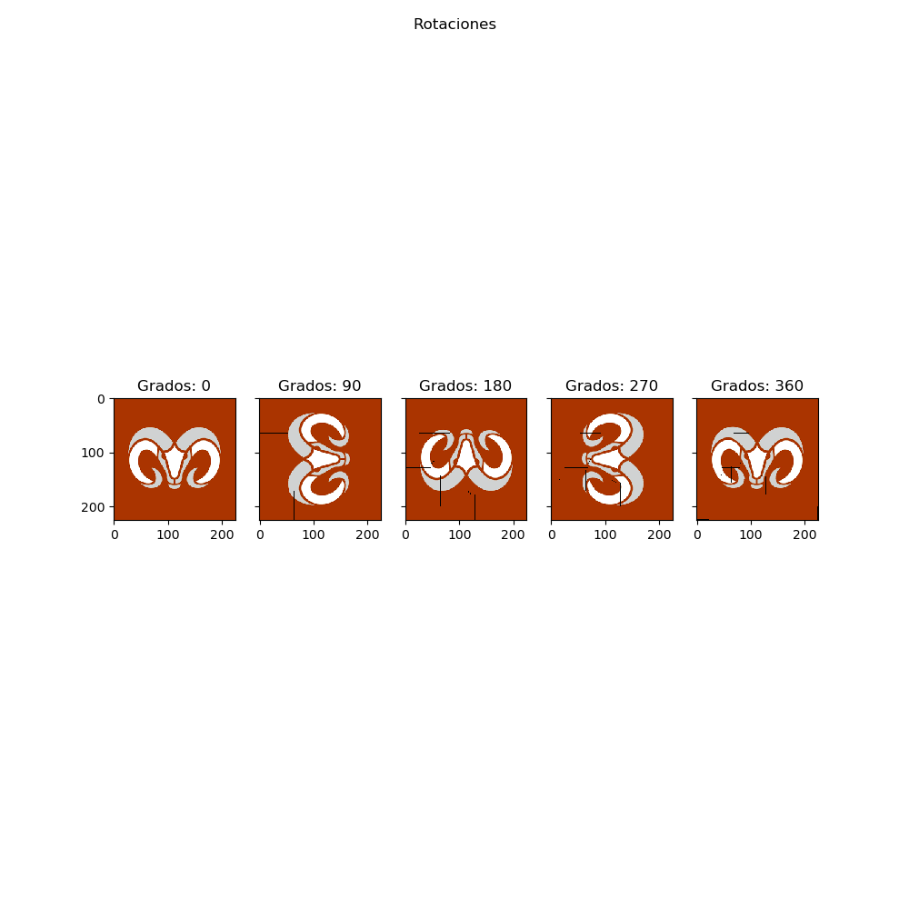
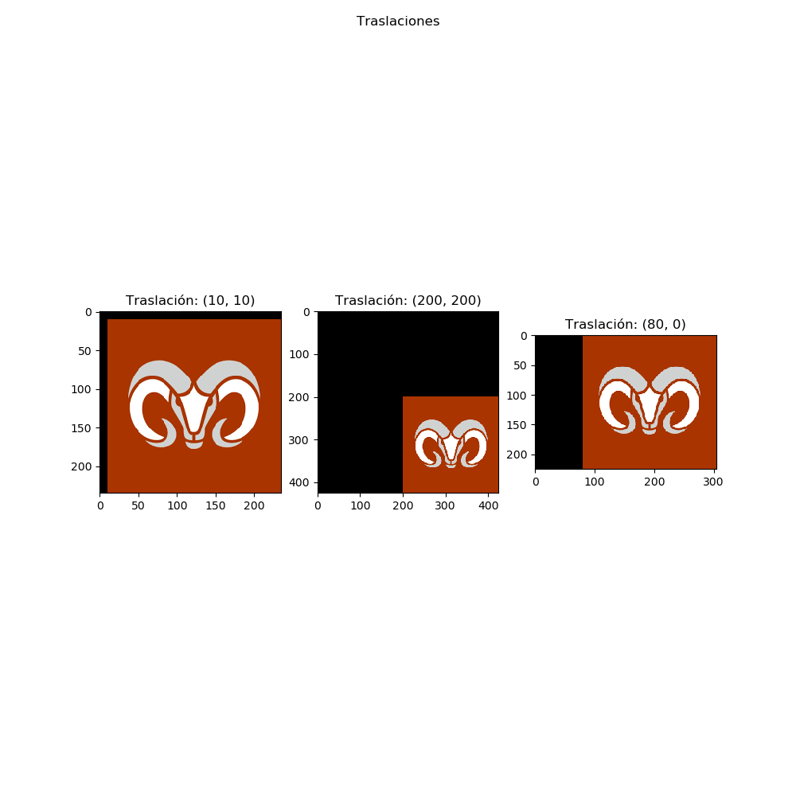
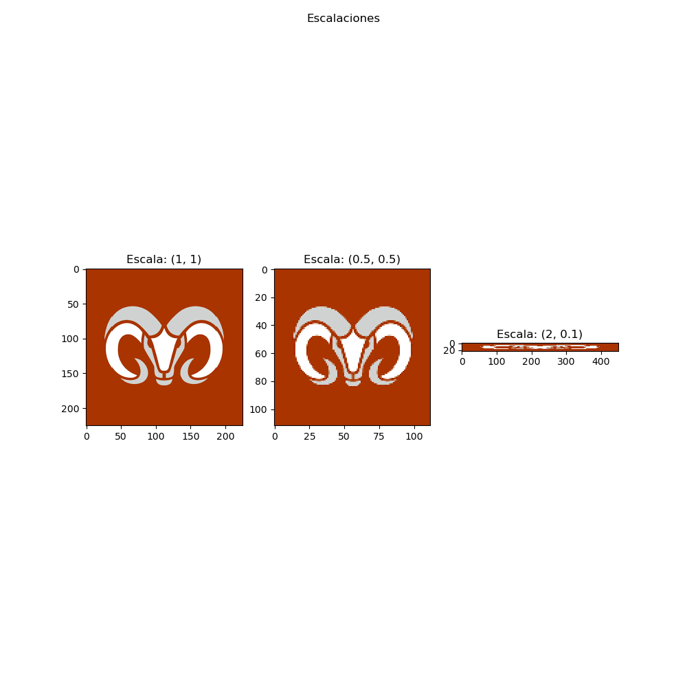
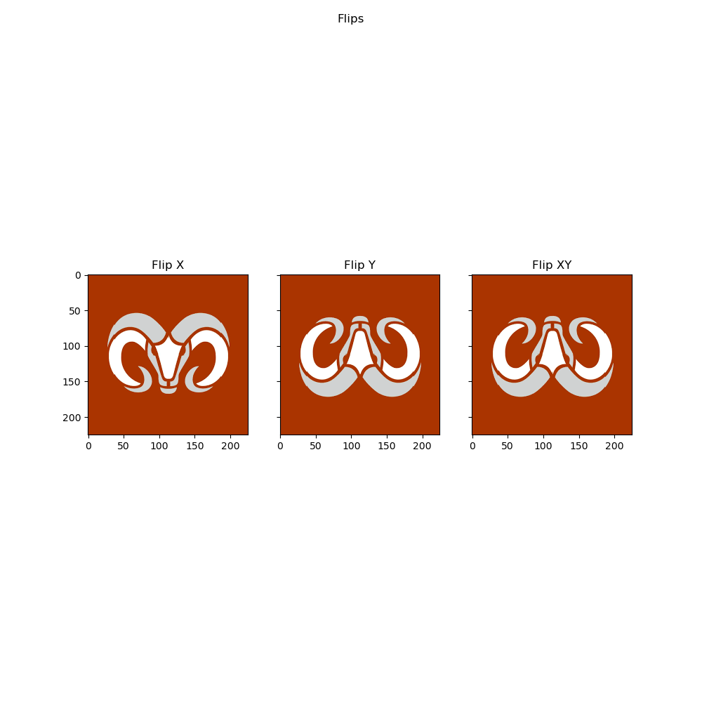

# **Computer Vision Projects**

## **Introduction**

This repository contains a collection of computer vision projects developed during my final semester of college. Each project explores different fundamental techniques used in image processing and computer vision, including histogram analysis, filtering, feature detection, and geometric transformations.

## **Projects**

### **1. Histogram Analysis**

- **Image Histogram Calculation** – Implementation of histogram computation to analyze pixel intensity distributions.
- **Histogram Equalization** – Enhancing image contrast by redistributing pixel intensities.

### **2. Image Filtering**

This section explores image filtering techniques using convolutional kernels. The implemented functions apply custom and OpenCV-based filtering to enhance images and extract features.

- **Custom Convolutional Filtering** – A manually implemented filtering function applies a kernel to an image using element-wise multiplication and summation, similar to OpenCV's `filter2D`.

- **Edge Detection with Derivative Kernels** – Implements Sobel-like filters using custom derivative kernels for detecting horizontal and vertical edges.
- **Laplacian Edge Detection** – Combines derivatives in the X and Y directions to generate a Laplacian edge map, highlighting significant transitions in intensity.

- 

### **3. SIFT**

- **SIFT (Scale-Invariant Feature Transform)** – Extracting key points and descriptors for object recognition.

### **4. Geometric Transformations**

This section focuses on fundamental geometric transformations applied to images, including rotation, translation, scaling, and flipping. The implemented functions perform these operations manually, demonstrating their mathematical foundations.

- **Image Rotation** – Rotates an image by a given angle using a transformation matrix.

- **Image Translation** – Shifts an image in the x and y directions while preserving its content.

- **Image Scaling** – Resizes an image using interpolation techniques to maintain quality.

- **Image Flipping** – Mirrors the image across the x-axis, y-axis, or both.

